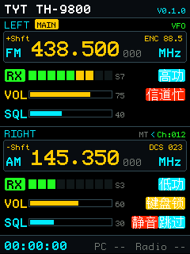

# sim — ESP32 屏幕 UI 桌面模拟器

在 PC 上实时预览 ESP32 控制盒的 240×320 屏幕 UI，无需烧录即可验证界面效果。使用与固件完全相同的 `embedded-graphics` 绘图代码，输出 PNG 图片供直接对比。

---

## `sim_output.png` — 当前 UI 截图

下图为控制盒主界面（模拟器生成，与实机效果 1:1 一致）：



---

## 功能

- 在 Windows/Linux/macOS 上渲染 ESP32 屏幕 UI（240×320，scale=1）
- 输出 `sim_output.png`，与实机坐标系完全一致（已通过 `calibrate/` 校准固件验证）
- 增量编译约 **0.2 秒**出图，远快于编译固件（2-5 分钟）+ 烧录（1-2 分钟）

---

## 使用方法

```bash
cd sim
cargo run
# → 生成 sim_output.png（240×320）
```

用文件管理器刷新 `sim_output.png` 即可预览最新效果。

---

## 开发流程

1. 在 `sim/src/main.rs` 的 `draw_main_ui()` 函数中修改 UI 代码
2. `cargo run` → 0.2 秒出图
3. 反复调整直到满意
4. 将改动同步回 `../src/ui.rs`（配色常量、绘图函数保持一致）
5. 只在最终效果确认后才编译 ESP32 固件 + 烧录

---

## 注意事项

- `sim/` 是独立 Rust 项目，**不依赖** ESP-IDF 或任何 HAL 相关代码
- `.cargo/config.toml` 覆盖父目录编译目标，强制使用 `x86_64-pc-windows-msvc`，不要修改
- 配色常量需与 `../src/ui.rs` 保持同步
- `OutputSettingsBuilder` 的 `scale(1)` 保持 240×320 原始分辨率，不要更改
